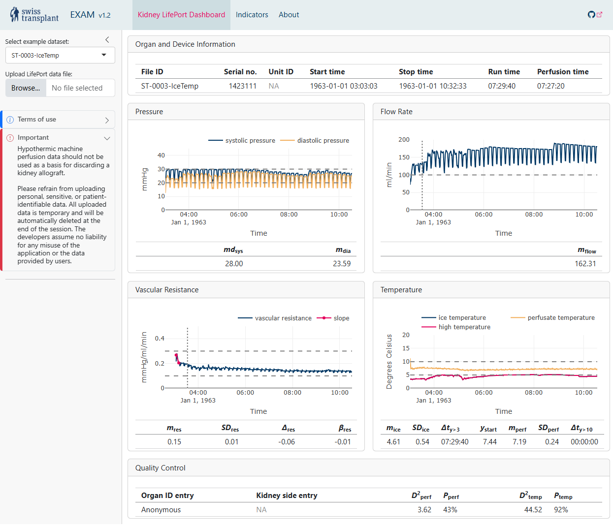

# EXAM: Ex vivo allograft monitoring dashboard

EXAM (ex vivo allograft monitoring) is an analytics dashboard for the for the analysis of hypothermic machine per-fusion data in deceased-donor kidney transplantation.

## Background
Deceased-donor kidney allografts are exposed to injury during ex vivo transport due to the lack of blood oxygen supply. Hypothermic machine perfusion (HMP) effectively reduces the risk of delayed graft function in kidney transplant recipients compared to standard cold storage. However, there is no software implementation available to read, process and analyse HMP data for state-of-the-art visualization and quality control.

## Project description
EXAM was written in the R programming laungage and is based on the following tools.
* [flexdashbord](https://pkgs.rstudio.com/flexdashboard/), a interactive dashboard for R
* [plotly](https://plotly.com/graphing-libraries/), a graphics library for interactive charts
* [shiny](https://shiny.posit.co/), R package for interactive web applications
* [swt](https://github.com/Swisstransplant/swt), the Swisstransplant R package

## References

Schwab, S., Steck, H., Binet, I., Elmer, A., Ender, W., Franscini, N., Haidar, F., Kuhn, C., Sidler, D., Storni, F., Krügel, N., & Immer, F. (2023). EXAM: Ex vivo allograft monitoring dashboard for the analysis of hypothermic machine perfusion data in deceased-donor kidney transplantation. *Research Square*. [doi:10.21203/rs.3.rs-2713168/v1](https://doi.org/10.21203/rs.3.rs-2713168/v1)

## Screenshot

## Live demo

A live demo is available at [https://swisstransplant.shinyapps.io/EXAM/](https://swisstransplant.shinyapps.io/EXAM/).
